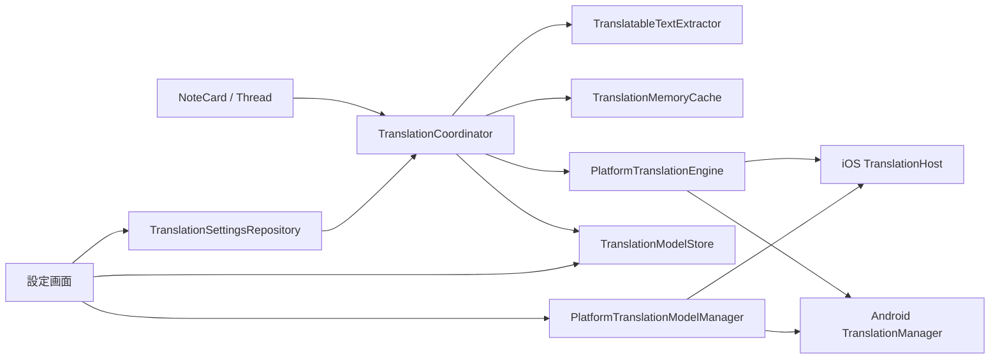
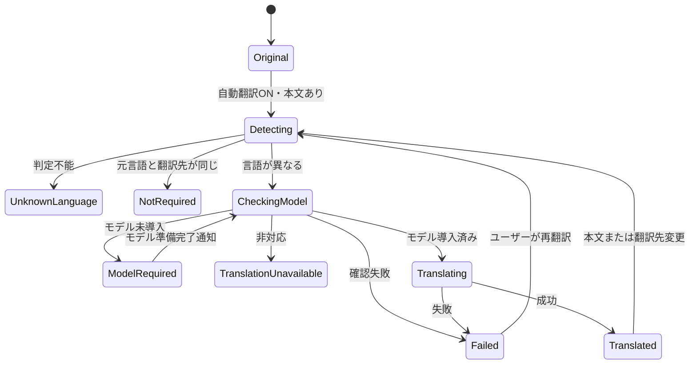
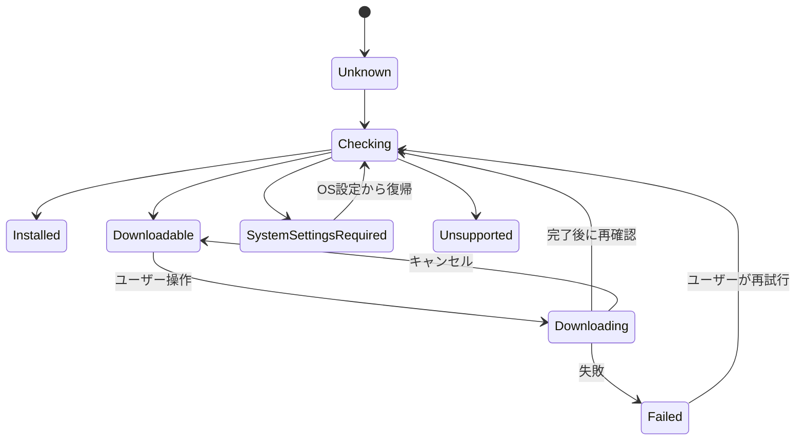

# 投稿自動翻訳設計

作成日: 2026-09-16
状態: 再レビュー済み。未実装。

## 1. 目的

投稿本文の言語を端末上で判定し、ユーザーが指定した言語と異なる場合にOSの翻訳機能で翻訳して表示する。

本設計では次を保証する。

- Nostrイベントと署名対象の原文を変更しない。
- 言語判定、翻訳、言語モデル準備の失敗をフィード全体へ波及させない。
- 言語モデルのダウンロードは、ユーザーの明示操作なしに開始しない。
- 原文と翻訳文をいつでも切り替えられる。
- 翻訳先言語や本文が変わった後に、古い非同期結果を表示しない。
- 原文と翻訳文を診断ログへ記録しない。

## 2. 決定事項

1. 翻訳にはOSが提供する端末内翻訳機能だけを使用する。外部翻訳APIへ本文を送信しない。
2. 設定は端末単位とし、アカウント切り替えの影響を受けない。
3. `autoTranslate`の初期値は`false`とする。仕様に初期値の指定がないため、モデル準備と表示変更をユーザーの選択なしに発生させない安全側の値を採用する。
4. `translationTargetLanguage`は保存値がなければOS優先言語から決める。日本語は`ja`、英語は`en`、それ以外は`en`とする。
5. 自動翻訳ONは翻訳方針の有効化であり、モデルダウンロードへの同意とは扱わない。
6. モデル導入済みの言語ペアだけ自動翻訳する。未導入の場合は原文を表示し、モデル管理への導線を出す。
7. iOSではユーザーが「ダウンロード」を選択した場合だけ`prepareTranslation()`を実行する。フィード表示、アプリ起動、設定スイッチ変更だけでは呼び出さない。
8. 投稿イベントは変更せず、翻訳結果を表示用の派生状態として保持する。
9. 初版の翻訳結果キャッシュはメモリだけに置き、アプリ終了後には残さない。
10. 初版の対象は通常の投稿カードとスレッド内投稿本文とする。引用プレビュー、返信先プレビュー、記事、ライブ、チャンネル本文への適用は、通常投稿の動作確認後に同じ表示コンポーネントへ段階的に展開する。

## 3. 対象OSとフォールバック

現在の最低OSはAndroid API 24とiOS 16である。一方、使用する翻訳APIの最低要件はこれより新しいため、実行時の機能判定を必須とする。

| 環境 | 言語判定 | 翻訳 | 動作 |
| --- | --- | --- | --- |
| iOS 18以上の実機 | Natural Language | Translation framework | 利用可能な言語ペアだけ翻訳 |
| iOS 16〜17 | 利用可能 | Translation framework利用不可 | 原文表示、設定を無効化 |
| iOSシミュレーター | 判定可能 | 翻訳不可 | 原文表示、実機確認を案内 |
| Android API 31以上 | TextClassifier | TranslationManager | 端末サービスが提供する言語ペアだけ翻訳 |
| Android API 24〜30 | 一部OSで判定可能 | TranslationManager利用不可 | 原文表示、設定を無効化 |

APIの存在だけで利用可能と判断しない。OSバージョン、システムサービス、言語ペアの能力、モデル状態を順に確認する。

非対応環境でもフィード、スレッド、投稿操作は通常どおり動作する。非対応は投稿単位の失敗としても扱わず、翻訳機能全体の`PlatformUnavailable`として表示する。

## 4. 用語とデータモデル

### 4.1 言語コード

将来の言語追加で列挙分岐を増やさないため、言語はBCP 47を基礎とする文字列値で扱う。受信した言語タグは可能な限り保持し、比較規則は保存形式から分離する。

```kotlin
@JvmInline
value class LanguageCode(val value: String) {
    companion object {
        val Japanese = LanguageCode("ja")
        val English = LanguageCode("en")
        val Unknown = LanguageCode("unknown")
    }
}
```

初版の翻訳先である日本語と英語については、`ja-JP`と`ja`、`en-US`と`en-GB`のように基底言語が同じなら翻訳不要とする。将来`zh-Hans`と`zh-Hant`などを追加するときは、基底言語が同じという理由だけで同一扱いせず、`LanguageEquivalencePolicy`へ明示的に規則を追加する。OS APIへは、利用可能であれば元の地域・文字体系情報を保持したコードを渡す。

### 4.2 ユーザー設定

```kotlin
data class TranslationSettings(
    val autoTranslate: Boolean = false,
    val targetLanguage: LanguageCode,
)
```

設定Repositoryは読込状態も公開する。

```kotlin
sealed interface TranslationSettingsState {
    data object Loading : TranslationSettingsState
    data class Ready(val settings: TranslationSettings) : TranslationSettingsState
    data class SaveFailed(
        val settings: TranslationSettings,
    ) : TranslationSettingsState
}
```

`Loading`中は安全側として自動翻訳OFF相当とする。保存に失敗した値を成功済み設定として配信せず、直前の保存済み設定を維持して設定画面にだけエラーを表示する。

保存キーは次のとおりとする。

- `auto_translate_v1`
- `translation_target_language_v1`

保存値が不正な場合はクラッシュさせず、初期値へ戻す。将来の対応言語追加時も保存形式は言語コード文字列のまま維持する。

### 4.3 投稿要求キーと翻訳キャッシュキー

```kotlin
data class PostContentKey(
    val eventId: String,
    val contentHash: String,
)

data class PostTranslationRequestKey(
    val content: PostContentKey,
    val targetLanguage: LanguageCode,
)

data class TranslationCacheKey(
    val request: PostTranslationRequestKey,
    val sourceLanguage: LanguageCode,
)
```

言語判定結果は翻訳先を変えても再利用できるため、`PostContentKey`でキャッシュする。言語判定前には元言語が確定していないため、画面とCoordinatorの要求統合には`PostTranslationRequestKey`を使う。判定成功後の翻訳結果キャッシュには元言語を加えた`TranslationCacheKey`を使う。

`contentHash`は抽出後の`translatableText`からSHA-256などの安定したハッシュで生成する。イベントIDだけをキーにしない。同じIDに対して表示前処理が変わった場合や、翻訳先変更後に旧結果が返った場合に誤表示しないため、本文ハッシュと翻訳先言語を含める。ハッシュ値はログへ出力しない。

### 4.4 投稿翻訳状態

```kotlin
data class PostTranslationState(
    val originalContent: String,
    val translatableText: String,
    val originalDocument: NoteContentDocument,
    val detectedLanguage: LanguageCode = LanguageCode.Unknown,
    val translatedContent: String? = null,
    val translatedDocument: NoteContentDocument? = null,
    val targetLanguage: LanguageCode,
    val status: PostTranslationStatus = PostTranslationStatus.Original,
)

sealed interface PostTranslationStatus {
    data object Original : PostTranslationStatus
    data object Detecting : PostTranslationStatus
    data object NotRequired : PostTranslationStatus
    data object UnknownLanguage : PostTranslationStatus
    data object CheckingModel : PostTranslationStatus
    data object ModelRequired : PostTranslationStatus
    data object TranslationUnavailable : PostTranslationStatus
    data object Translating : PostTranslationStatus
    data object Translated : PostTranslationStatus
    data class Failed(val reason: TranslationFailure) : PostTranslationStatus
}
```

- `originalContent`は受信した`NostrEvent.content`そのものとする。
- `translatableText`は表示解析後の`TranslatableText`セグメントだけを連結した言語判定用文字列とする。
- `originalDocument`は翻訳対象と保護対象の意味と元順序を保持する。
- `translatedDocument`は翻訳対象セグメントだけを置換し、リンクなどの意味情報を維持した表示用文書とする。
- `translatedContent`は`translatedDocument`を平文化した文字列とし、仕様上必要な翻訳本文の保持とアクセシビリティ用に使う。通常のUI描画は`translatedDocument`を使う。

原文表示の選択は共有翻訳状態へ含めない。同じ投稿がフィードとスレッドへ同時表示されたとき、一方の操作が他方へ連動しないよう、各表示箇所が次の一時状態を所有する。

```kotlin
data class TranslationPresentationState(
    val showingOriginal: Boolean = false,
)
```

`showingOriginal`は`remember(eventId, targetLanguage)`による表示セッション内だけの状態とし、Coordinator、設定、イベント、翻訳キャッシュ、Bundle保存へ書き戻さない。長いフィードの全投稿分を保存状態へ積み上げないため、初版では`rememberSaveable`を使わない。翻訳キーまたは表示対象イベントが変わったら`false`へ戻す。

### 4.5 モデル状態

```kotlin
data class LanguagePair(
    val source: LanguageCode,
    val target: LanguageCode,
)

sealed interface TranslationModelState {
    data object Unknown : TranslationModelState
    data object Checking : TranslationModelState
    data object Installed : TranslationModelState
    data object Downloadable : TranslationModelState
    data object SystemSettingsRequired : TranslationModelState
    data object Downloading : TranslationModelState
    data object Unsupported : TranslationModelState
    data class Failed(val reason: ModelFailure) : TranslationModelState
}
```

OSの生の例外やローカライズ済みメッセージを共通状態へ保存しない。UIで安定して扱える分類へ変換する。

## 5. 責務分割



### 5.1 `TranslationSettingsRepository`

- 設定の読み込み、検証、保存を担当する。
- 端末共通の`StateFlow<TranslationSettings>`を公開する。
- OS初期言語の参照は保存値がない初回だけ行う。
- OS初期言語には端末の優先言語一覧の先頭を使用し、地域コードを除いた基底言語で`ja`、`en`、その他を判定する。
- 設定読込が完了するまで、自動翻訳を開始しない。
- 書き込みを直列化し、短時間の連続操作で古い保存完了が新しい選択を上書きしないようにする。
- 画面やアカウント単位のViewModelへ設定値を複製しない。

### 5.2 `TranslationCoordinator`

- 言語判定、翻訳要否判定、モデル確認、翻訳実行を順序制御する。
- 同じ`PostTranslationRequestKey`の重複要求を1件へ統合する。
- 設定世代と要求キーを検証し、古い結果を破棄する。
- 個々の投稿状態を公開するが、Nostrイベントを変更しない。
- モデル準備用のOS UIは起動しない。
- Composeの再コンポーズを新しい翻訳要求として扱わない。安定した`PostTranslationRequestKey`の監視開始・終了だけを受け取る。
- 画面から参照されなくなった投稿状態を解放し、状態Mapを無制限に増やさない。
- アカウントセッション単位で所有し、アカウント切り替え時に進行中要求をキャンセルして投稿翻訳状態と本文キャッシュを破棄する。

表示層は`DisposableEffect(requestKey)`で監視を取得・解放する。Coordinatorは同じキーの参照数を持ち、複数画面に同じ投稿が表示されても処理を共有する。`NoteCard`自身にコルーチン、モデル状態、翻訳キャッシュを所有させない。原文表示の選択だけは各表示箇所がローカルに所有する。

### 5.3 `TranslationModelStore`

- `LanguagePair`ごとのモデル状態を保持する。
- 同じ言語ペアの確認と準備要求を重複させない。
- アプリ復帰時とモデル準備完了後に状態を再確認する。
- ユーザーがキャンセルした準備を自動再実行しない。

### 5.4 プラットフォーム境界

OS実装との境界とする。共通層へSwiftやAndroid frameworkの型を露出しない。通常の翻訳機能と、ユーザー確認またはOS設定画面を起こし得るモデル管理機能は別interfaceにし、Coordinatorからモデル管理操作を呼べないよう型で制限する。

```kotlin
interface PlatformTranslationEngine {
    val platformAvailability: PlatformAvailability

    suspend fun detectLanguage(text: String): LanguageDetection

    suspend fun modelState(pair: LanguagePair): TranslationModelState

    suspend fun translate(
        text: String,
        pair: LanguagePair,
    ): PlatformTranslationResult
}

interface PlatformTranslationModelManager {
    suspend fun requestUserInitiatedPreparation(
        pair: LanguagePair,
        operationToken: String,
    ): ModelPreparationActionResult
}
```

`PlatformTranslationModelManager`は設定画面専用Controllerだけが所有し、Coordinatorや投稿UIへ渡さない。ボタン押下時にControllerがランダムな一回限りの`operationToken`を発行し、プラットフォーム側は同じ操作の重複実行を防ぐ冪等キーとして使う。トークン自体を権限証明とはみなさず、所有権の分離で呼び出し元を制限する。トークンには投稿IDや本文を含めず、ログにも出力しない。iOSではOSのダウンロード許可要求、Androidでは利用可能な場合にOS翻訳設定画面を開くため、戻り値は「要求完了」「設定画面を開いた」「キャンセル」「利用不可」を区別する。

`TranslationCoordinator`は`PlatformTranslationEngine`だけを受け取り、モデル管理APIへの参照を持たない。

## 6. 翻訳対象テキスト

生の`event.content`全体をそのまま翻訳しない。URLやNostr参照が翻訳によって変形すると、リンク、メンション、画像表示が壊れるためである。

### 6.1 前処理

現在`NoteCard.kt`内にprivateで置かれている`parseNoteContent(event)`と`ParsedNoteContent`を、そのまま翻訳層から呼ぶことはできない。また、現行戻り値は画像URLなどを除去した単一文字列であり、保護対象の位置を復元できない。実装時に純粋関数`NoteContentDocumentParser`へ切り出し、`NoteCard`と翻訳処理が同じ解析結果を共有する。

パーサーは表示用メディア情報と順序付き本文セグメントを返し、次を翻訳対象から除く。

- 画像、動画、音声のURL
- リンクプレビュー用URL
- `nostr:` URIと`@npub`などの参照
- カスタム絵文字コード
- 絵文字だけの部分
- 制御文字

抽出結果は文字列1本ではなく、順序付きセグメントとして表す。

```kotlin
sealed interface NoteBodySegment {
    data class TranslatableText(val text: String) : NoteBodySegment
    data class WebLink(val label: String, val url: String) : NoteBodySegment
    data class NostrReference(val raw: String, val target: String) : NoteBodySegment
    data class Hashtag(val raw: String, val tag: String) : NoteBodySegment
    data class CustomEmoji(val raw: String, val shortcode: String) : NoteBodySegment
}

data class NoteContentDocument(
    val body: List<NoteBodySegment>,
    val media: List<MediaMetadata>,
    val linkPreviewUrl: String?,
)
```

ハッシュタグ、通常のWebリンク、メンション、カスタム絵文字は型付き保護セグメントとして原文のまま保持する。画像などの添付URLと引用イベントURIは本文セグメントへ含めず、`media`や引用表示データとして保持する。言語判定には`TranslatableText`だけを改行で連結した文字列を使用する。翻訳時は通常テキストを段落単位で翻訳し、成功後に保護セグメントを元の順序で結合する。プレースホルダー文字列を翻訳APIへ混在させる方式は、プレースホルダー自体が変形する可能性があるため採用しない。

保護セグメントをまたぐ一文は分割されるため翻訳品質が下がる可能性があるが、リンク先やNostr参照を壊さないことを優先する。将来OS間で同等に保護属性を渡せるAPIが利用可能になった場合にだけ、文脈を維持する方式を別途検討する。

翻訳入力は有限にする。初期値として、言語判定には正規化後の先頭2,000 Unicode code pointまでを使用し、翻訳対象は合計20,000 code pointを上限とする。OS APIへ渡す単位は段落境界を優先して最大4,000 code pointへ分割する。上限超過時は切り詰めた翻訳を表示せず、原文を維持する。

複数分割のうち1件でも失敗した場合は、翻訳済み断片と原文を混在表示せず、投稿全体を原文へ戻す。すべて成功した場合だけ、元の段落順に結合して`translatedContent`を公開する。

### 6.2 表示

- 本文だけ`originalDocument`または`translatedDocument`へ切り替える。
- 画像、リンクプレビュー、引用イベント、リアクションなどは常に元イベントから表示する。
- 翻訳文を再度URL抽出やNostr参照解析へ通さず、原文解析で得た型付きセグメントを`TranslatedNoteBody`が描画する。
- 「本文をコピー」は初版では原文をコピーする既存動作を維持する。翻訳文コピーを追加する場合は別の明示メニューとする。

## 7. 言語判定

### 7.1 判定前の正規化

URL、Nostr URI、絵文字、句読点、空白だけの部分を除いた判定用文字列を作る。最大文字数を設け、長文全体を同期処理しない。

次のいずれかに該当する場合はOS判定を呼ばず`unknown`とする。

- 正規化後が空。
- URLまたは絵文字だけ。
- 有効文字が少なすぎる。
- 同一文字の極端な繰り返し。
- コンテンツ警告があり、ユーザーがまだ本文を表示していない。

初期閾値はCJK文字を含む場合4文字以上、それ以外は10文字以上とする。閾値は純粋関数にまとめ、実データのテスト結果に応じて変更できるようにする。

### 7.2 信頼度

OSが複数候補と信頼度を返す場合、初期値として次を満たすときだけ確定する。

- 最上位候補が0.70以上。
- 1位と2位の差が0.20以上。

OSが信頼度を提供できない、候補がない、例外になった場合は`unknown`とする。判定失敗を翻訳失敗としてユーザーへ表示しない。

## 8. 自動翻訳の状態遷移



`Detecting`、`CheckingModel`、`Translating`の間も原文を表示する。翻訳文が完成したときだけ一度に表示を切り替える。

設定をOFFにした場合は進行中要求をキャンセルし、表示を原文へ戻す。設定を再度ONにした場合、キーが一致する成功キャッシュは再利用してよい。

コンテンツ警告付き投稿は、ユーザーが「表示する」を選ぶまで言語判定にも翻訳にも渡さない。解除後に通常の状態遷移を開始する。これにより、非表示にした本文をOS処理へ先行投入しない。

## 9. モデル準備の状態遷移

モデル準備と自動翻訳を同じ状態機械にしない。



- `Downloadable`になっても自動的に`Downloading`へ進めない。
- `SystemSettingsRequired`は、アプリから未導入と非対応を確定できず、OS翻訳設定への導線だけ提供できる状態とする。
- 同時に準備する言語ペアは1件までとする。
- ユーザーキャンセル後は`Downloadable`へ戻し、バックグラウンド再試行しない。
- 成功コールバックだけで`Installed`にせず、OSの状態を再確認する。
- モデル準備中も投稿は原文のまま利用できる。

## 10. 設定画面

既存の設定画面に「翻訳」セクションを追加する。

### 10.1 表示項目

1. 自動翻訳スイッチ。
2. 翻訳先言語の選択。初版は日本語とEnglish。
3. プラットフォーム非対応時の説明。
4. 必要になった言語ペアとモデル状態。
5. `Downloadable`の場合の「ダウンロード」操作。
6. `SystemSettingsRequired`の場合の「OSの翻訳設定を開く」操作。
7. `Failed`の場合の簡潔な説明と「再試行」。

### 10.2 操作規則

- 自動翻訳をONにしただけではOS確認画面を出さない。
- 翻訳先変更だけではモデルを準備しない。
- 「ダウンロード」押下時に対象言語ペアを再確認し、すでに`Installed`なら準備処理を省略する。
- Androidの「OSの翻訳設定を開く」はダウンロード完了を意味しない。アプリ復帰後に能力を再確認する。
- 準備中は対象ボタンを無効化し、多重操作を防ぐ。
- OSダイアログの拒否やキャンセルはエラー通知を連続表示せず、元の状態へ戻す。

フィードでは同一言語ペアごとに案内を重複表示しない。投稿ごとのボタンではなく、「一部の投稿の翻訳モデルが必要です」という集約導線を表示し、設定画面のモデル一覧へ遷移する。

## 11. iOS実装

### 11.1 API

- 言語判定: Natural Languageの`NLLanguageRecognizer`。
- 言語ペア確認: Translationの`LanguageAvailability.status(from:to:)`。
- 翻訳とモデル準備: `TranslationSession`。

`.installed`はそのまま翻訳可能、`.supported`は準備可能、`.unsupported`は利用不可へ対応付ける。

### 11.2 SwiftUIホスト

Translation frameworkはSwift中心で、iOS 18〜25を支えるにはSwiftUIの`translationTask`からセッションを受け取る必要がある。そのため、現在Composeの`UIViewController`を返している`ContentView.swift`を、翻訳ホストを所有するSwiftUI `View`へ変更する。

```swift
struct ContentView: View {
    @ViewBuilder
    var body: some View {
        #if targetEnvironment(simulator)
        ComposeContainer(translationBridge: UnsupportedTranslationBridge())
        #else
        if #available(iOS 18.0, *) {
            TranslationEnabledContentView()
        } else {
            ComposeContainer(translationBridge: UnsupportedTranslationBridge())
        }
        #endif
    }
}

@available(iOS 18.0, *)
private struct TranslationEnabledContentView: View {
    @StateObject private var translationHost = IOSTranslationHost()

    var body: some View {
        ComposeContainer(translationBridge: translationHost)
            .translationTask(translationHost.configuration) { session in
                await translationHost.process(using: session)
            }
    }
}
```

概念例であり、生成されるKotlin/NativeのSwiftシグネチャを確認して型名を確定する。

`IOSTranslationHost`とTranslation frameworkを参照するSwift型は全体を`@available(iOS 18.0, *)`で囲む。iOS 16〜17の分岐からそれらの型を生成・参照しない。`IOSTranslationHost`は対応OSのアプリルートで1つだけ生成し、投稿カードごとに`TranslationSession`やSwiftUIホストを作らない。

iOSシミュレーターではコンパイル時のターゲット判定で`PlatformUnavailable`を返し、Translation sessionを作らない。

SwiftにKotlinの`suspend` interfaceを直接実装させない。`iosMain`にObjective-C互換のコールバック型`IosTranslationBridge`と、それを`suspend`へ変換する`IosPlatformTranslationAdapter`を置く。Swiftはbridgeだけを実装し、共通層はadapter経由で`PlatformTranslationEngine`と`PlatformTranslationModelManager`を利用する。

bridgeの引数と戻り値は文字列、整数、単純なDTOに限定し、`TranslationSession`、`Locale.Language`、Swiftの`Error`をKotlinへ渡さない。adapterはキャンセル時にSwift Taskの取消を要求し、完了コールバックとの競合で継続を二重再開しない。

Swiftホストのキュー、`Configuration`、コールバック完了は`@MainActor`で直列化する。一方、`NLLanguageRecognizer`による判定、入力正規化、ハッシュ生成はメインスレッドを塞がない実行コンテキストで行い、結果反映だけMainActorへ戻す。キャンセル済み世代の判定結果は破棄する。

### 11.3 要求キュー

- Swiftホストは`@MainActor`でキューと`activeOperation`を直列管理する。
- 翻訳要求を`LanguagePair`ごとにまとめる。
- 1つの構成で同じ言語ペアの複数本文をバッチ翻訳する。
- バッチ項目には本文を含まない一意な`clientIdentifier`を付け、応答を要求キーへ対応付ける。ストリーミング応答の到着順を要求順と仮定しない。
- 異なる言語ペアは直列に切り替える。
- 同じ構成へ新規要求を追加した場合は、構成の世代を更新して`translationTask`を再実行するか、ホスト内の継続キューで処理する。
- セッションを`translationTask`の有効範囲外へ保存しない。
- 要求完了、失敗、キャンセルの全経路でコールバックを一度だけ完了する。
- 自動翻訳経路では、`LanguageAvailability`が`.installed`であることを翻訳開始直前に再確認する。`.supported`のセッションに対して`translate`を呼ばない。

明示的なモデル準備要求は、待機中の自動翻訳より優先する。すでに実行中の翻訳バッチがある場合は安全にキャンセルし、表示中の要求だけを準備完了後に再キューする。構成切り替えには操作IDと世代を付け、旧`translationTask` closureが完了しても新しい操作の状態を上書きしない。同時に複数の`Configuration`を有効化しない。

iOS 26以降だけの直接セッション初期化APIへ初版を依存させない。iOS 18以上という機能境界を維持する。

iOS 18〜25には「導入済みモデルだけを使用する」専用初期化APIがないため、状態確認とセッション実行の間にごく短い競合区間が残る。通常は`.installed`確認直後に翻訳することで回避するが、その間にOSがモデルを削除した場合の挙動をアプリから完全には固定できない。実機試験で予期しない準備UIが出ないことを確認し、厳密にゼロを保証する必要が生じた場合は、iOS 26以上では導入済みモデル専用初期化を使用し、iOS 18〜25の自動翻訳提供条件を再検討する。

### 11.4 モデル準備

1. Composeの設定画面でユーザーがダウンロードを選び、一回限りの操作トークンを発行する。
2. Swiftホストへ対象`LanguagePair`を渡す。
3. Swift側でアプリがアクティブかつ表示可能な状態であることを確認する。
4. `TranslationSession.Configuration`を対象ペアへ設定する。
5. `translationTask`内で`prepareTranslation()`を呼ぶ。
6. 完了後に`LanguageAvailability`を再確認する。
7. `Installed`なら共通層へモデル更新イベントを通知する。
8. 表示中かつ`PostTranslationRequestKey`が一致する`ModelRequired`投稿だけ再処理する。

アプリ起動、画面再構成、フィードスクロールを契機に手順4〜5へ進んではならない。Swift側は受領済み操作トークンを記録し、同じトークンを二度処理しない。SwiftUIの再評価や`configuration.invalidate()`だけで準備処理を再実行しない。

`prepareTranslation()`には元言語が必須なので、`Configuration`の`source`と`target`をどちらも明示する。元言語が`unknown`の要求をモデル準備キューへ入れない。言語がすでに導入済み、またはダウンロード中の場合に`prepareTranslation()`が確認なしで戻る場合も、手順6の再確認を省略しない。

### 11.5 ライフサイクル

- バックグラウンド移行後に新しいモデル準備UIを開始しない。
- 翻訳中のTaskはキャンセル可能にする。キャンセル後の結果を共通状態へ反映しない。
- メモリ警告時は翻訳結果キャッシュを縮小できる。
- OS設定などでモデルが削除される可能性を考慮し、アプリ復帰時に`Installed`状態を再確認する。
- モデル準備はOS確認画面でのユーザー操作を含むため、固定時間で失敗させない。画面破棄、明示キャンセル、アプリ終了でのみ取り消す。
- 通常の言語判定、能力確認、翻訳にはそれぞれ有限の期限を設け、期限超過後の遅延結果を反映しない。

## 12. Android実装

### 12.1 API

- 言語判定: API 29以上の`TextClassifier.detectLanguage()`。
- 翻訳: API 31以上の`TranslationManager`と`Translator`。
- 能力確認: `getOnDeviceTranslationCapabilities()`。

能力確認はワーカースレッドで行う。API 31以上でも、端末メーカーが翻訳サービスを提供しない、対象言語ペアを持たない、Translatorを生成できない場合は原文へフォールバックする。

### 12.2 モデル管理

AndroidではOS実装によってモデル管理UIの有無が異なる。`getOnDeviceTranslationCapabilities()`のスナップショットだけでは、一覧にない言語ペアが「ダウンロード可能」なのか「非対応」なのかを常に判別できない。`TranslationCapability.STATE_AVAILABLE_TO_DOWNLOAD`は能力更新通知では届き得るが、能力一覧取得から返ることは保証されないためである。

対象ペアが`STATE_ON_DEVICE`なら`Installed`とする。導入済み能力が見つからず、`getOnDeviceTranslationSettingsActivityIntent()`が得られる場合は`SystemSettingsRequired`とし、ユーザー操作からだけOS設定を開く。設定画面から戻った後、または能力更新通知を受けた後に能力を再確認する。

導入済み能力も設定Intentもない端末では、初版は`Unsupported`として「この端末では翻訳を準備できません」と表示し、アプリ独自ダウンロードや外部翻訳へ切り替えない。この状態は「その言語ペアが永続的に非対応」と断定する診断には使わず、端末の現在能力として扱う。

能力更新listenerはAndroid Gatewayの開始時に1回だけ登録し、Gateway破棄時に必ず解除する。設定画面の再コンポーズごとに登録しない。更新通知は対象言語ペアのキャッシュ無効化に使い、通知内容だけで翻訳開始せず、ワーカースレッドで能力を再取得してから状態を確定する。

### 12.3 Translatorの所有権

- 言語ペア単位の小さなプールで所有する。
- 使用中のTranslatorを破棄しない。
- Coordinator終了時またはプールからの退避時に`destroy()`する。
- Android 12のキャッシュ挙動を考慮し、別所有者と同じTranslatorを共有しない。
- コールバックをコルーチンへ変換する際、キャンセルと完了の競合で二重再開しない。

## 13. 同時実行、キャッシュ、再試行

### 13.1 同時実行

- 言語判定は最大4件。
- 翻訳は全体で最大2件。
- モデル準備は最大1件。
- 同一`PostTranslationRequestKey`の呼び出しは同じDeferredを共有する。
- 表示中の投稿を優先し、先読みは初版では行わない。
- 投稿表示の監視には参照数を持たせ、最後の表示元が破棄されたときに未開始要求をキューから除く。

具体値は定数として集約し、テストと端末計測で変更できるようにする。

言語判定、モデル確認、翻訳の期限は別定数にする。モデル準備には通常翻訳と同じタイムアウトを適用しない。

### 13.2 キャッシュ

```text
言語判定キー: eventId + contentHash
要求統合キー: 言語判定キー + targetLanguage
成功キャッシュキー: 要求統合キー + sourceLanguage
値: 言語判定結果またはtranslatedContent
上限: 200投稿を初期値とするLRU
保存先: メモリのみ
```

- `unknown`判定は短時間キャッシュしてよい。
- 翻訳失敗は成功結果と同じ期間キャッシュしない。
- モデル未導入は永続的な失敗としてキャッシュしない。
- 設定OFFでも成功キャッシュは保持できるが、表示は原文へ戻す。

### 13.3 再試行

- 判定・翻訳失敗で自動無限再試行しない。
- 一時失敗の自動再試行は最大1回、短いジッター付き遅延後に限る。
- ユーザーの「再翻訳」は待機時間を迂回できる。
- モデル準備のキャンセルは自動再試行しない。
- ネットワーク再接続はOSモデル準備の自動再開理由にしない。

## 14. 表示とアクセシビリティ

### 14.1 投稿本文

| 状態 | 本文 | 補助操作 |
| --- | --- | --- |
| Original / Detecting / CheckingModel / Translating | 原文 | 原則なし |
| NotRequired / UnknownLanguage | 原文 | なし |
| ModelRequired | 原文 | 集約したモデル管理導線 |
| TranslationUnavailable | 原文 | なし |
| Translated | 翻訳文 | 原文を表示 |
| TranslatedかつshowingOriginal | 原文 | 翻訳を表示 |
| Failed | 原文 | 必要に応じて再翻訳 |

翻訳中に本文を消したり、カード高をプレースホルダーへ置き換えたりしない。翻訳成功時のレイアウト変化は許容するが、リスト位置が大きく飛ばないようLazyListの安定キーにイベントIDを使用する。

### 14.2 読み上げ

- 「原文を表示」「翻訳を表示」はボタンとして読み上げ可能にする。
- 翻訳文であることを視覚表示だけに依存させず、必要に応じてセマンティクスへ説明を付ける。
- モデル準備中は状態を読み上げ、無効なボタンを連打させない。
- OSダイアログから戻った後、設定画面の適切な位置へフォーカスを戻す。

## 15. エラーと診断情報

共通層へ公開する失敗分類は限定する。

```kotlin
enum class TranslationFailure {
    Cancelled,
    PlatformUnavailable,
    LanguageUnsupported,
    ModelUnavailable,
    InvalidInput,
    TimedOut,
    Internal,
}
```

`Cancelled`は診断上の分類であり、画面に残る`Failed`状態にはしない。設定OFF、画面破棄、キー変更によるキャンセルでは`Original`へ戻すか、参照がなければ状態自体を解放する。

ログへ記録してよい情報:

- OS種別とバージョン。
- API利用可否。
- 言語コードとモデル状態。
- 要求数、処理時間、失敗分類。
- 本文を含まない要求ID。

ログへ記録しない情報:

- 原文と翻訳文。
- 本文から抽出したURL、メンション、ハッシュタグ。
- プロフィール名。
- OS例外に本文が含まれる可能性がある生の`description`。

イベントIDも公開投稿とは限らない将来拡張を考慮し、必要な場合はセッション内のランダム要求IDまたは短期ハッシュへ置き換える。

## 16. 既存コードへの組み込み

新設名は実装時の仮称とする。

### 16.1 共通コード

```text
composeApp/src/commonMain/kotlin/com/nostr/torinos/translation/
├── LanguageCode.kt
├── TranslationModels.kt
├── TranslationSettingsRepository.kt
├── TranslationCoordinator.kt
├── TranslationModelStore.kt
├── TranslationMemoryCache.kt
├── TranslatableTextExtractor.kt
├── PlatformTranslationEngine.kt
└── PlatformTranslationModelManager.kt
```

- `App.kt`: 端末共通の設定Repository、Platform Engine、ModelStoreをアプリ生存期間で所有する。
- `AppSessionHost`またはアカウントセッション所有UI: `TranslationCoordinator`と本文を含むメモリキャッシュをセッション単位で生成・破棄する。設定と導入済みモデル状態だけをアカウント間で共有する。
- `SettingsScreen.kt`: 翻訳設定とモデル管理セクションを追加する。
- `NoteCard.kt`: 既存の`parsedContent.textContent`表示を`TranslatedNoteBody`へ委譲する。
- `ThreadScreen.kt`: `NoteCard`と同じCoordinatorを利用し、画面固有の翻訳処理を作らない。

```text
composeApp/src/commonMain/kotlin/com/nostr/torinos/ui/content/
├── NoteContentDocument.kt
├── NoteContentDocumentParser.kt
└── NoteContentDocumentRenderer.kt
```

現行の`NoteCard.kt`内private `ParsedNoteContent`と`parseNoteContent`はこの共通パーサーへ移す。既存の`LinkedText`相当のリンク、メンション、ハッシュタグ、カスタム絵文字描画も型付きセグメントを受け取るRendererから再利用する。画像・リンク・引用の抽出規則を翻訳用に複製せず、既存表示と翻訳前処理の差異を防ぐ。

### 16.2 iOS

```text
iosApp/iosApp/Translation/
├── IOSTranslationHost.swift
├── IOSTranslationBridge.swift
└── IOSLanguageRecognizer.swift
```

- `ContentView.swift`: SwiftUI翻訳ホストとComposeコンテナを構成する。
- `MainViewController.kt`: Swift実装の`IosTranslationBridge`を引数で受け取り、`iosMain`のadapterを介して共通層へ注入する。

```text
composeApp/src/iosMain/kotlin/com/nostr/torinos/translation/
├── IosTranslationBridge.kt
└── IosPlatformTranslationAdapter.kt
```

Androidも`MainActivity`でEngineとModelManagerを生成して`App`へ渡す。`App`はプラットフォーム依存実装をグローバル変数から取得せず、入口から依存性を受け取る。テストではFakeを渡す。

### 16.3 Android

```text
composeApp/src/androidMain/kotlin/com/nostr/torinos/translation/
├── AndroidTranslationPlatform.kt
├── AndroidLanguageRecognizer.kt
└── AndroidTranslatorPool.kt
```

既存のDataStoreとUserDefaultsを使う`LocalSettingsStorage`へ文字列値を保存する。設定の型変換とデフォルト決定は`TranslationSettingsRepository`へ集約する。

## 17. 導入順序

1. 言語コード、設定Repository、要否判定、状態遷移を共通コードに追加し、Fake EngineとFake ModelManagerで単体テストする。
2. `TranslatableTextExtractor`と本文表示切り替えを追加する。プラットフォーム実装は未対応のまま、原文表示の回帰がないことを確認する。
3. iOSの言語判定、モデル状態確認、導入済みモデルによる翻訳を実装する。
4. iOS設定画面の明示的なモデル準備導線を実装する。
5. iOS実機でダウンロード、キャンセル、削除後の再確認を検証する。
6. Android API 31以上のEngine、ModelManager、能力確認、Translatorのライフサイクルを実装する。
7. フィードとスレッドで段階的に有効化する。最初は開発用フラグ、次に既定OFFのユーザー設定として公開する。
8. 計測結果を確認した後、引用プレビューなど追加の本文表示へ展開する。

各段階で非対応OSのビルドと原文表示を維持する。iOS翻訳実装の完了を待たず、共通設定だけを有効化して空のダウンロード導線を公開してはならない。

## 18. テスト計画

### 18.1 共通単体テスト

1. 自動翻訳OFFでは言語判定を呼ばない。
2. 同一言語では翻訳とモデル確認を呼ばない。
3. `unknown`は原文表示になる。
4. URL、絵文字、Nostr URIだけの投稿は`unknown`になる。
5. 異なる言語かつモデル導入済みの場合だけ翻訳する。
6. モデル未導入は`ModelRequired`となり、翻訳を呼ばない。
7. 非対応言語ペアは`TranslationUnavailable`となり、再試行可能な`Failed`と区別する。
8. 翻訳失敗時に原文を維持する。
9. 同じキーの同時要求が1件へ統合される。
10. 本文、翻訳先、設定世代が変わった後の旧結果を破棄する。
11. OFF切り替えで進行中要求をキャンセルし、原文へ戻す。
12. 原文／翻訳文の切り替えでイベント内容が変化しない。
13. 失敗の自動再試行が上限を超えない。
14. 翻訳先変更時に`PostContentKey`の言語判定結果を再利用し、旧翻訳結果は再利用しない。
15. 同じ投稿を複数箇所へ表示しても翻訳処理は共有され、原文表示の選択は表示箇所ごとに独立する。
16. アカウント切り替えで旧Coordinatorの処理をキャンセルし、旧アカウントで見た本文と翻訳結果を新セッションへ引き継がない。
17. 翻訳後もWebリンク、Nostr参照、ハッシュタグ、カスタム絵文字の型とリンク先が原文文書と一致する。

### 18.2 iOSテスト

1. iOS 16〜17でTranslation frameworkのコードパスへ入らない。
2. iOS 18以上で`.installed`、`.supported`、`.unsupported`を正しく変換する。
3. フィード表示と自動翻訳ONだけでは`prepareTranslation()`を呼ばない。
4. 明示的なボタン操作1回につき準備要求が最大1回発生する。
5. SwiftUI再構成で準備要求を再実行しない。
6. ダウンロードキャンセル後に原文表示と再試行可能状態を維持する。
7. 準備完了後に状態を再確認し、導入済みの場合だけ投稿を再処理する。
8. バックグラウンド中に新しい確認画面を開始しない。
9. シミュレーターでクラッシュせず原文表示になる。
10. 英語、日本語、第三言語の複数言語ペア要求を直列化できる。
11. iOS 16〜17の実行経路からTranslation frameworkの型を生成しない。
12. 元言語が`unknown`の準備要求を拒否し、`prepareTranslation()`へ渡さない。
13. `.supported`の自動翻訳要求では`translate()`を呼ばず、予期しない準備UIを表示しない。

翻訳動作とモデル準備はiOS 18以上の実機で確認する。シミュレーターの成功を受け入れ条件にしない。

### 18.3 Androidテスト

1. API 24〜30で翻訳APIへ入らない。
2. API 31以上でもTranslationManagerまたは能力がない場合に原文表示する。
3. 能力確認をメインスレッドで実行しない。
4. Translator生成失敗、空応答、エラー応答で原文を維持する。
5. キャンセルとコールバック完了が競合してもコルーチンを二重再開しない。
6. 所有中のTranslatorを処理完了前に`destroy()`しない。
7. OS設定Intentがない場合にモデル管理ボタンを実行不能として表示する。
8. 能力一覧に対象ペアがなく設定Intentがある場合、`Unsupported`ではなく`SystemSettingsRequired`になる。
9. 能力更新listenerを一度だけ登録し、Gateway破棄時に解除する。

### 18.4 UIと回帰テスト

1. 翻訳処理中も本文、画像、リンク、リアクションを操作できる。
2. 翻訳文表示中に「原文を表示」、原文表示中に「翻訳を表示」が切り替わる。
3. コンテンツ警告を解除する前に言語判定や翻訳を開始しない。
4. NGワード判定、ミュート、通報、コピー、返信、引用、削除の対象は原文イベントのままである。
5. 高速スクロール、画面回転、アカウント切り替え後に別投稿の翻訳文が混入しない。
6. 翻訳設定の保存失敗でフィードを停止しない。
7. アプリ再起動後に設定だけ復元され、翻訳キャッシュがなくても原文から正常に再処理できる。
8. 設定読込中は翻訳要求を開始せず、保存失敗時は直前の保存済み設定を維持する。
9. 20,000 code pointを超える入力や分割翻訳の部分失敗で、切り詰め文や原文との混在を表示しない。
10. 翻訳文表示中もリンク、メンション、ハッシュタグ、カスタム絵文字が原文表示時と同じ対象へ動作する。

## 19. 受け入れ条件

1. 自動翻訳OFFではすべて原文表示となる。
2. 自動翻訳ONかつ言語が異なり、モデル導入済みの場合は翻訳文を表示する。
3. 言語判定不能、同一言語、モデル未導入、非対応、翻訳失敗では原文を表示する。
4. モデル未導入によってフィード読み込みや他の投稿表示が失敗しない。
5. モデル準備はユーザーがダウンロード操作を選んだ場合だけ開始する。
6. モデル準備の拒否、キャンセル、失敗後もアプリを通常利用できる。
7. モデル準備完了後、画面に残っている対象投稿を再翻訳できる。
8. 翻訳済み投稿で原文と翻訳文を往復できる。
9. 切り替え、翻訳、再試行のいずれでも`NostrEvent`を変更しない。
10. 翻訳先言語変更後に旧翻訳先の文を表示しない。
11. iOS 16〜17、Android API 24〜30、iOSシミュレーターでクラッシュしない。
12. 原文と翻訳文がログおよび外部サービスへ送信されない。

## 20. 禁止事項

- フィード表示中にモデル準備ダイアログを自動表示する。
- 自動翻訳ONをモデルダウンロード同意として扱う。
- `event.content`を翻訳文で上書きする。
- 翻訳文を署名、投稿、返信、引用、通報、NGワード判定の入力に使う。
- 投稿カードごとにOS翻訳セッションを作る。
- 翻訳失敗をフィード全体のエラー状態へ昇格する。
- OSの生の例外説明や投稿本文をログへ記録する。
- 非対応OSで外部翻訳APIへ暗黙にフォールバックする。
- ユーザーがキャンセルしたモデル準備を自動再開する。
- 翻訳結果をイベントIDだけでキャッシュする。
- 設定読込前にOS言語だけを使って暫定翻訳を開始する。
- 分割翻訳の一部だけを原文へ混在させて表示する。

## 21. 参考資料

- [Apple: Translating text within your app](https://developer.apple.com/documentation/translation/translating-text-within-your-app)
- [Apple: TranslationSession](https://developer.apple.com/documentation/translation/translationsession)
- [Apple: LanguageAvailability](https://developer.apple.com/documentation/translation/languageavailability)
- [Apple: NLLanguageRecognizer](https://developer.apple.com/documentation/naturallanguage/nllanguagerecognizer)
- [Android: TranslationManager](https://developer.android.com/reference/android/view/translation/TranslationManager)
- [Android: Translator](https://developer.android.com/reference/android/view/translation/Translator)
- [Android: TextClassifier](https://developer.android.com/reference/android/view/textclassifier/TextClassifier)
