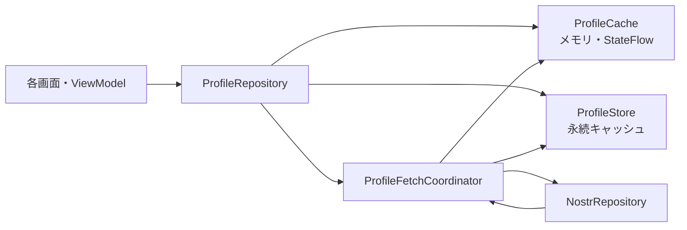

# プロフィールキャッシュ設計

## 目的

ToriNosにおけるNostr kind 0プロフィールの表示、更新、取得を一元管理する。

- キャッシュ済みプロフィールを即時表示する
- 複数画面からの重複リクエストを防ぐ
- 古いkind 0イベントによるプロフィールの巻き戻りを防ぐ
- プロフィール画面ではキャッシュを表示しながら最新情報へ更新する
- 将来の永続キャッシュ導入に対応する

## 全体構成



画面とViewModelは`ProfileRepository`だけを利用する。`ProfileCache`とkind 0購読を画面から直接操作しない。

## 実装状況

2026年8月22日時点で、メモリキャッシュと画面移行について次の項目を実装済みである。

- `ProfileRepository`による統一参照API
- `CacheOnly`、`CacheFirst`、`ForceRefresh`の取得ポリシー
- `ProfileFetchCoordinator`による200ミリ秒のバッチ統合
- 最大100pubkeyの一括kind 0取得
- pending・in-flightによる重複要求の抑止
- EOSE集約と8秒タイムアウトによる有限購読
- 未取得プロフィールの60秒負キャッシュ
- 成功・失敗後の5秒クールダウン
- `fetchedAt`を利用した鮮度判定
- 自分と他ユーザーのプロフィール画面のRepository移行
- 自己紹介文に含まれるnpubプロフィール取得のRepository移行
- フィード、スレッド、ライブ、記事、投稿メモのRepository移行
- チャンネル、検索、通知、設定、アカウント設定画面のRepository移行
- フォロー一覧、リアクション一覧、ステータス、ミュート一覧のRepository移行
- `verifyNoDirectProfileSubscriptions`によるkind 0直接購読の再発防止

永続キャッシュ、NIP-65を使った取得先の最適化、診断メトリクスは今後の実装対象である。

## ProfileCache

### 責務

- メモリ上のプロフィール保持
- kind 0イベントの検証
- 最新イベントの決定
- 楽観的なローカル更新
- `StateFlow`による更新通知

通信と永続化は行わない。

### エントリー

```kotlin
data class ProfileCacheEntry(
    val profile: NostrProfile,
    val eventId: String?,
    val createdAt: Long,
    val fetchedAt: Long,
)
```

| フィールド | 用途 |
|---|---|
| `profile` | 表示用プロフィール |
| `eventId` | 元kind 0イベントのID |
| `createdAt` | Nostrイベントの新旧判定 |
| `fetchedAt` | キャッシュの鮮度判定 |

pubkeyは`Map<String, Entry>`のキーとして保持する。`eventId == null`は、対応する元イベントをまだ受信していない楽観更新を表す。

`createdAt`と`fetchedAt`は目的が異なるため、同じ値として扱わない。

### 最新イベント判定

kind 0イベントは次の順序で比較する。

1. `createdAt`が大きいイベントを採用する
2. `createdAt`が同一の場合は、イベントIDが辞書順で小さいイベントを採用する
3. 古いイベントを受信した場合はキャッシュを変更しない
4. kind 0以外のイベントは受け付けない

## ProfileRepository

画面がプロフィールを利用するための唯一の入口とする。

```kotlin
interface ProfileRepository {
    fun observe(pubkey: String): Flow<NostrProfile?>

    fun observe(pubkeys: Set<String>): Flow<Map<String, NostrProfile>>

    suspend fun get(pubkey: String): NostrProfile?

    suspend fun ensureProfiles(
        pubkeys: Set<String>,
        policy: ProfileFetchPolicy,
        relayHint: String? = null,
    )

    suspend fun refresh(
        pubkey: String,
        relayHint: String? = null,
    )

    fun applyOptimistic(
        pubkey: String,
        profile: NostrProfile,
    )
}
```

### 禁止事項

画面とViewModelでは次の処理を行わない。

- `ProfileCache.putEvent()`の直接呼び出し
- kind 0の直接購読
- 画面固有の通信中・負キャッシュ・再試行状態の管理
- 画面固有のプロフィール新旧判定

## 取得ポリシー

```kotlin
sealed interface ProfileFetchPolicy {
    data object CacheOnly : ProfileFetchPolicy

    data class CacheFirst(
        val maxAgeMillis: Long,
    ) : ProfileFetchPolicy

    data object ForceRefresh : ProfileFetchPolicy
}
```

### 推奨設定

| 利用箇所 | ポリシー |
|---|---|
| タイムライン | `CacheFirst(15分)` |
| スレッド・通知 | `CacheFirst(15分)` |
| フォロー・フォロワー一覧 | `CacheFirst(1時間)` |
| プロフィール画面 | キャッシュ即時表示後に`ForceRefresh` |
| オフライン表示 | `CacheOnly` |
| プロフィール編集後 | 楽観更新後に遅延`ForceRefresh` |

`ForceRefresh`でもキャッシュを削除しない。キャッシュ値を表示したままバックグラウンドで更新する。

## ProfileFetchCoordinator

### 責務

- 複数画面からのプロフィール要求を統合する
- キャッシュが新鮮なpubkeyを除外する
- 取得中のpubkeyを重複リクエストしない
- 複数pubkeyを1つのkind 0フィルターへまとめる
- タイムアウト、EOSE、再試行を管理する
- 受信結果をキャッシュと永続ストアへ渡す

### 管理状態

```kotlin
private val pendingPubkeys: Set<String>
private val inFlightPubkeys: Set<String>
private val lastRequestedAt: Map<String, Long>
private val missingUntil: Map<String, Long>
```

### バッチ取得

1. 要求されたpubkeyを`pendingPubkeys`へ追加する
2. 100〜300ミリ秒待機して同時期の要求を統合する
3. キャッシュが新鮮なpubkeyを除外する
4. `inFlightPubkeys`に含まれるpubkeyを除外する
5. 最大100件を1つのkind 0購読にまとめる
6. EOSEまたはタイムアウトで購読を閉じる
7. 見つからなかったpubkeyは30〜60秒間再取得しない
8. 通信失敗時は指数バックオフで再試行する

同じpubkeyを複数画面が同時に要求した場合も、原則として1回の論理リクエストへ統合する。

## リレー選択

プロフィール取得先は次の優先順位で決定する。

1. 呼び出し元から渡された`relayHint`
2. 対象ユーザーのNIP-65リレー
3. 現在の画面で使用中のリレー
4. 既定リレー1〜2件
5. 見つからない場合に限り取得範囲を拡大する

初回から全有効リレーへ送信しない。論理リクエストが1回でも、全リレーへ送るとリレー数分のREQが発生するためである。

## プロフィール画面の動作

1. `ProfileRepository.observe(pubkey)`を購読する
2. メモリキャッシュがあれば即時表示する
3. メモリにない場合は永続キャッシュを読み込む
4. 画面表示時に`ForceRefresh`を要求する
5. 受信した最新kind 0をキャッシュへ保存する
6. `StateFlow`の更新により画面を再描画する

通常の再コンポーズでは再取得しない。画面を開き直した場合にのみ再取得する。

## 楽観更新

プロフィール編集時は次の順序で処理する。

1. kind 0イベントを署名する
2. 署名済みイベントまたは編集結果をキャッシュへ反映する
3. UIを即時更新する
4. リレーへ公開する
5. 公開成功後に遅延して`ForceRefresh`する
6. 公開失敗時はエラーを表示し、必要に応じて以前のエントリーへ戻す

署名済みイベントを利用できる場合は、プロフィールだけの楽観更新よりイベント全体をキャッシュへ保存する方を優先する。

## 永続キャッシュ

永続化は`ProfileStore`としてメモリキャッシュから分離する。

### 保存項目

- pubkey
- event ID
- createdAt
- kind 0のcontent
- tags
- fetchedAt

`NostrProfile`だけでなく元イベントを保存し、モデル変更時に再パースできるようにする。

### 保存方針

- モバイルではRoomを使用する
- メモリには最近利用した500〜2,000件程度を保持する
- 永続ストアにはメモリより多くのプロフィールを保持する
- 最終参照日時を使って古いデータを整理する
- アプリ再起動後は永続キャッシュを即時表示し、必要に応じて再検証する

## エラーと再試行

- タイムアウトは1リクエストあたり5〜10秒を目安とする
- EOSE受信後は購読を閉じる
- 見つからなかったプロフィールも短時間の負キャッシュへ登録する
- リレー障害時は同一pubkeyへ即時再送しない
- 再試行は指数バックオフと最大回数を設定する
- キャッシュがある場合、通信エラーで画面からプロフィールを消さない

## 計測項目

次の値をログまたは診断画面で確認できるようにする。

- キャッシュヒット率
- メモリキャッシュ件数
- 永続キャッシュ件数
- kind 0の論理リクエスト数
- 実際に各リレーへ送信したREQ数
- バッチあたりのpubkey数
- 重複排除された要求数
- タイムアウト数
- プロフィール画面表示から初回表示までの時間
- プロフィール画面表示から最新値反映までの時間

## テスト方針

### ProfileCache

- 新しいイベントの後に古いイベントを受信しても巻き戻らない
- `createdAt`が同一の場合にイベントIDで決定できる
- kind 0以外を拒否する
- 楽観更新が即時通知される
- 新しいkind 0受信後に楽観値が置き換わる

### ProfileFetchCoordinator

- 同じpubkeyへの同時要求が1回へ統合される
- 複数pubkeyが1つのREQへまとめられる
- 取得中のpubkeyが再送されない
- 負キャッシュ期間中に再送されない
- EOSEとタイムアウトで状態が解放される
- 再試行が上限を超えない

### ProfileRepository

- キャッシュ値が通信結果より先に通知される
- `CacheOnly`で通信しない
- 新鮮な`CacheFirst`で通信しない
- 期限切れの`CacheFirst`で更新する
- `ForceRefresh`でキャッシュを表示したまま更新する

## 導入状況

1. ✅ `ProfileRepository`と`ProfileFetchCoordinator`を追加
2. ✅ `ProfileCache`をRepository内部へ隔離
3. ✅ プロフィール画面をRepositoryへ移行
4. ✅ フィード、スレッド、ライブ、記事を移行
5. ✅ チャンネル、検索、通知、設定などを移行
6. ✅ kind 0の直接購読をビルド時に検査
7. ⬜ リクエスト数とキャッシュヒット率を計測
8. ⬜ 永続キャッシュを追加

## 完了条件

- 画面とViewModelがkind 0を直接購読していない
- 同じpubkeyへの同時要求が統合される
- プロフィール画面でキャッシュが即時表示される
- プロフィール画面を開いたときに最新値が再検証される
- 古いイベントでプロフィールが巻き戻らない
- 通信失敗時もキャッシュ表示が維持される
- リクエスト数とキャッシュヒット率を確認できる
